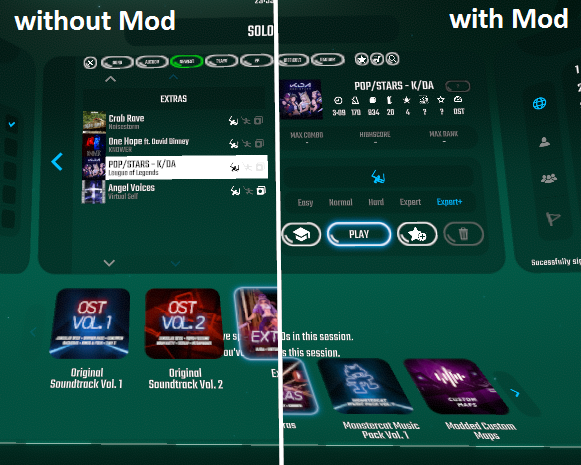

# Beat Saber Level Pack Panel Mover

Moves the bottom panel (containing the level packs) of the Beat Saber main menu further down.

Ever got annoyed by accidentally clicking on a level pack while scrolling down in your song list? Then this mod is for you! 

You can change the position of the panel in the in-game settings menu (look for "Lvl Pack Panel Mover").

## Installation

Drop the DLL file into your plugins folder. 

## Removal

Delete the DLL file from your plugins folder.

## Example
